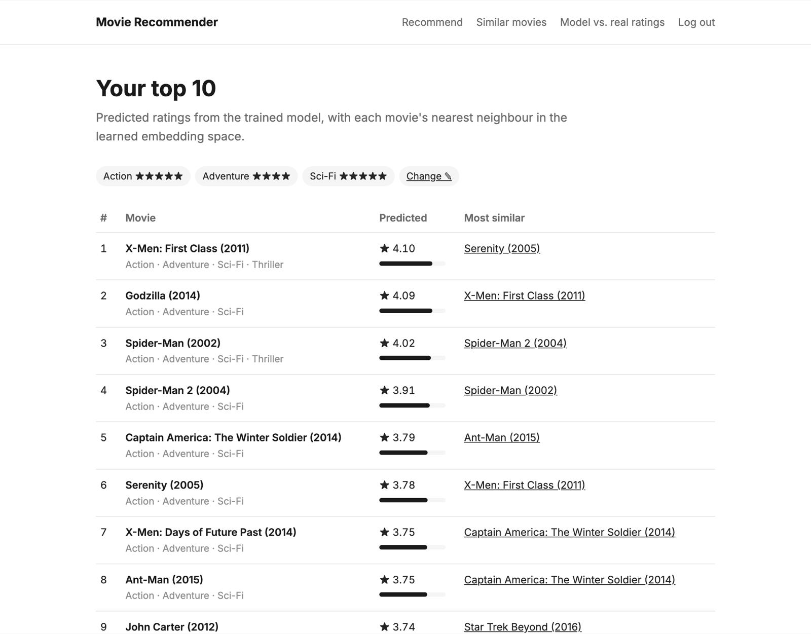
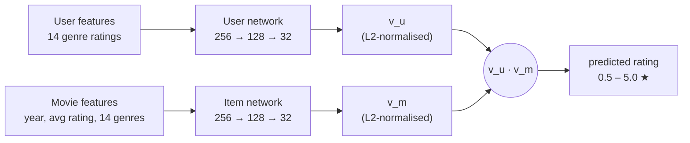
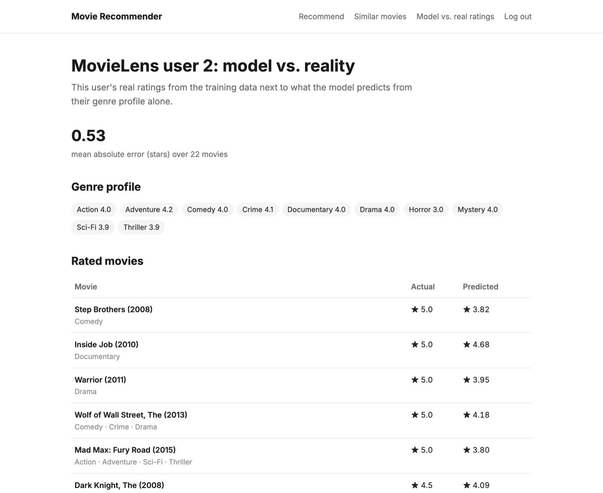
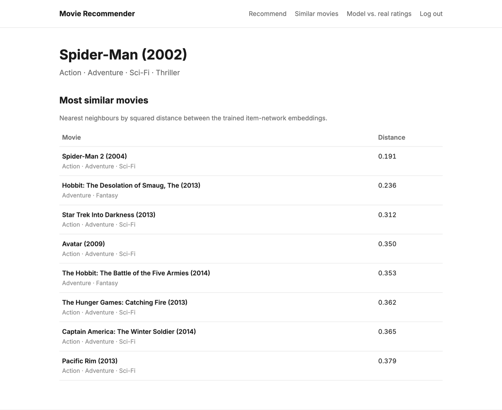

# Enhanced Content-Based Movie Recommender

[](https://doi.org/10.5281/zenodo.7965018)


A two-tower neural recommender that learns embeddings for users and movies from
content features, and predicts a rating as a single dot product. This is the code
for my Bachelor's thesis, published at **NCECA 2023**:

> Thanush Raj U., J. Jebamalar Tamilselvi. *Enhanced Customer Content Based
> Recommendation System.* NCECA 2023. [doi:10.5281/zenodo.7965018](https://doi.org/10.5281/zenodo.7965018)

**[▶ Try the live demo](https://thanushthrony.github.io/projects/recommender-demo.html)**:
the same trained model, running entirely in your browser.



## How it works



- **Two towers.** A user network embeds a user's per-genre rating profile and an
  item network embeds a movie's content (release year, average rating, genres).
  Both are `Dense(256, ReLU) → Dense(128, ReLU) → Dense(32)` followed by L2
  normalisation, so the dot product lies in [-1, 1] and maps to the rating scale.
- **Training.** Mean squared error on ~50,000 MovieLens ratings, Adam (lr 0.01),
  30 epochs, 80/20 train/test split. Features are standardised and ratings
  min-max scaled to [-1, 1].
- **Retrieval, then ranking.** A cheap genre-overlap pass shortlists 80
  candidates, and only those are scored by the network. Movie embeddings don't
  depend on the user, so all 847 are computed once at start-up.
- **Similar movies for free.** Users and movies share one embedding space, so the
  nearest neighbours of a movie's embedding are "movies like this one".
  Spider-Man (2002)'s nearest neighbour is Spider-Man 2.

| Model vs. real ratings | Similar movies |
|---|---|
|  |  |

## Quickstart

```bash
git clone https://github.com/thanushthrony/movie-recommender.git
cd movie-recommender
pip install -r requirements.txt
python app.py            # http://127.0.0.1:5000
```

Sign up (accounts live in a local SQLite file under `instance/`), rate a few
genres, and get your top 10. Set `SECRET_KEY` in the environment for anything
beyond local use.

The app serves predictions with NumPy, reading the trained weights straight from
`model/new_model.h5`, so TensorFlow is only needed for training.

```bash
pytest                   # 11 tests; the Keras-parity test runs if TensorFlow is installed
```

## Train it yourself

```bash
pip install -r requirements-train.txt
python train.py                          # retrain with the thesis settings
python train.py --l2 1e-4 --out model/l2_model.h5   # with an L2 weight penalty
python export_model_for_web.py           # refresh demo/model-data.js
```

The shipped `model/new_model.h5` was trained without an L2 penalty (its saved config has no
regularisers). By default `train.py` writes `model/retrained.h5`, leaving the thesis model untouched.

## Project structure

```
├── app.py                    Flask app: accounts, recommendations, similar movies, model vs. real ratings
├── recommender.py            Inference: loads trained weights, runs both towers in NumPy, retrieval + ranking
├── data_utils.py             Loads the preprocessed MovieLens matrices
├── models.py                 SQLAlchemy user model
├── train.py                  Builds and trains the two-tower Keras model
├── export_model_for_web.py   Exports weights and embeddings for the browser demo
├── model/new_model.h5        Trained model from the thesis
├── data/                     Preprocessed MovieLens training data (847 movies, 397 users)
├── demo/                     In-browser demo (open demo/index.html), same as the portfolio page
├── templates/, static/       Flask UI
└── tests/                    pytest suite
```

## What changed since the thesis version

The model is unchanged; the code around it was cleaned up for publishing:

- **User input is actually used.** The original `/ml` route built a vector from
  the visitor's preferences, then overwrote it with training user #2, so everyone
  got the same recommendations.
- **"Similar movies" uses the trained item network.** The original built a
  fresh, untrained network for this step, so similarities came from random weights.
- **Portable paths and config.** Paths no longer depend on a hard-coded
  local folder or on a case-insensitive filesystem (`./data` vs `Data/`).
  The secret key comes from the environment.
- **Load once, vectorise.** The model was reloaded from disk on every request,
  and movie distances were a pure-Python O(n²) loop. Both are now computed once
  with NumPy.
- **Security.** Removed a route that listed every user's email and password hash
  without login, and the test databases are no longer part of the project.
- **Tests.** Added a pytest suite, including a check that the NumPy forward pass
  matches Keras' `model.predict` to 1e-5.

## Data and acknowledgements

- Ratings and movie metadata come from the [MovieLens](https://grouplens.org/datasets/movielens/)
  "latest-small" dataset (F. Maxwell Harper and Joseph A. Konstan, 2015, *ACM TiiS* 5(4)).
- The preprocessed training matrices and the starting point for the two-tower
  architecture come from the content-based filtering lab in DeepLearning.AI's
  Machine Learning Specialization. The thesis built on that lab with the Flask
  application, retrieval-and-ranking pipeline and evaluation.

---

Built by [Thanush Raj Uma Babu](https://thanushthrony.github.io) · M.Sc. Data Science, FAU Erlangen-Nürnberg
